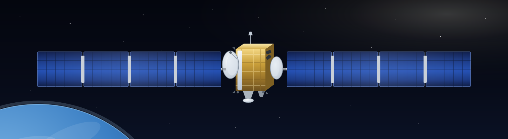
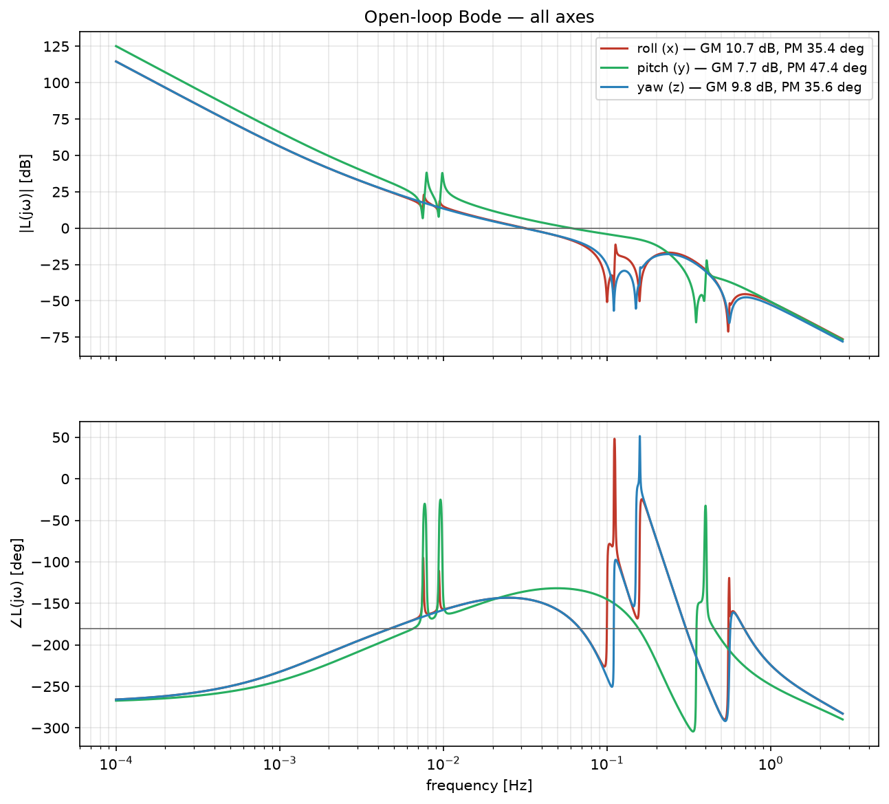
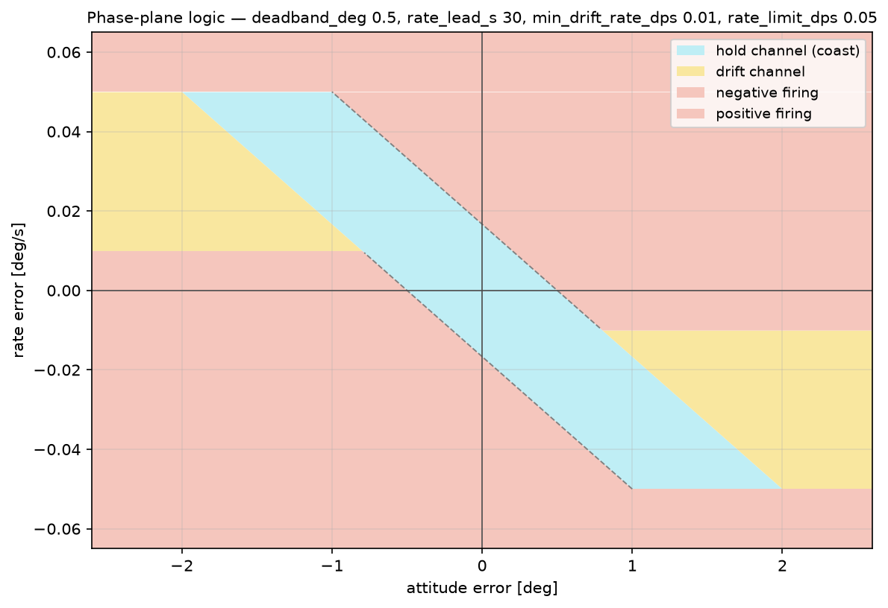
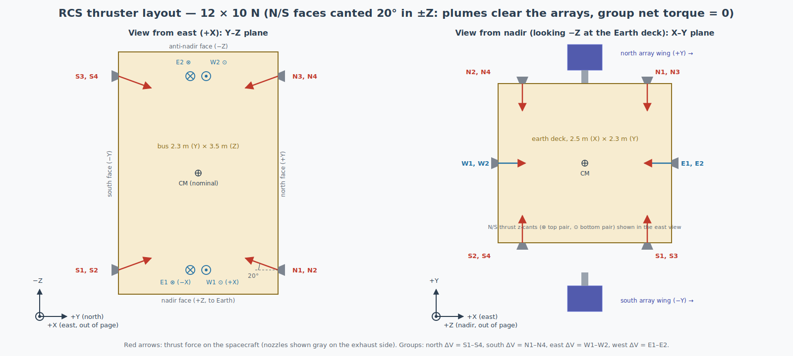

# spacecraft-acs



*The modeled spacecraft: 3000 kg wet mass with two ~120 kg solar array wings
spanning ~22 m tip-to-tip along the pitch (north-south) axis — the geometry
behind J = diag(15000, 3000, 14500) kg·m², the 0.10–0.55 Hz array modes that
rotate between roll and yaw as the wings track the sun, and the two
propellant tanks whose slosh modes sit below the control bandwidth.*

Attitude control system design and analysis for a large GEO satellite with
large flexible solar arrays. Supports the classical GNC workflow:

1. **Flexible-body dynamics** — rigid hub + appendage modes, hybrid-coordinate
   formulation
2. **Control design** — discrete quaternion-error PID with structural filters
3. **Analysis** — nonlinear time-domain step response, and linearized
   frequency-domain margins (Bode / Nichols / closed-loop transfer functions)

All spacecraft parameters, controller gains, filters, sensor/actuator models,
and simulation settings are configurable through a single YAML file.

## Installation

```sh
pip install -e .[dev]
pytest            # run the verification suite
```

## Usage

```sh
acs step      --config config/default.yaml --output-dir output  # time domain
acs freq      --config config/default.yaml --output-dir output  # frequency domain
acs compare   --config config/default.yaml --output-dir output  # slew vs step
acs unload    --config config/default.yaml --output-dir output  # momentum dump
acs mc        --config config/default.yaml --output-dir output  # Monte Carlo
acs burn      --config config/default.yaml --output-dir output  # delta-V burn
acs hold      --config config/default.yaml --output-dir output  # thruster hold
acs holdmc    --runs 30                    --output-dir output  # hold dispersions
acs thrusters --config config/default.yaml                      # RCS geometry table
```

`acs step` runs the nonlinear closed-loop simulation of a commanded attitude
step (default: 1° about roll while nadir tracking), prints rise time /
overshoot / settling time and steady-state pointing, and writes a time-history
plot (attitude error, rates, wheel torque and momentum vs. limits, modal
response). With `guidance.profiler.enabled: true` the same command is executed
as a smooth profiled slew instead.

`acs compare` runs the configured maneuver twice — once as a profiled slew
with acceleration feedforward, once as a raw quaternion step without — and
overlays attitude error, rate, torque, and modal response, with a metrics
table (settling time, overshoot, peak torque, flex ringing).

`acs unload` demonstrates a thruster momentum dump during nadir hold: wheel
momentum decay through the trigger/target thresholds, the quantized pulse
train, and the pointing transient (arcsec-level with wheel feedforward
compensation of each pulse).

`acs mc` runs the plant-dispersion Monte Carlo (`--runs N`, `--time-domain`):
the controller stays fixed while inertia, mode frequencies, damping, and
participation are dispersed; each sample is scored on loop-at-a-time margins,
worst flexible-mode peak, and coupled closed-loop stability, with a
scatter/histogram plot and CSV export.

`acs freq` linearizes each axis about the nadir-pointing operating point and
writes open-loop Bode and Nichols plots with the gain and phase margins called
out, plus closed-loop `T(s) = L/(1+L)` and `S(s) = 1/(1+L)` magnitude plots.
The console report lists GM/PM with crossover frequencies, closed-loop
bandwidth and peaks (Mt, Ms), and the peak open-loop gain at each flexible
resonance (gain-stabilization check).

## Model

### Flexible dynamics (`dynamics.py`)

Hybrid-coordinate equations for a rigid hub with N mass-normalized flexible
modes coupled through the 3×N rotational participation matrix **L**:

```
J ω̇ + L η̈ + ω × (J ω + L η̇ + h_w) = T_wheel + T_dist
η̈ + 2 Z Ω η̇ + Ω² η + Lᵀ ω̇ = 0
q̇ = ½ q ⊗ [0, ω]           (scalar-first quaternion, inertial → body)
ḣ_w = −T_wheel
```

Each mode is configured by its cantilever frequency, damping ratio, and
participation 3-vector; `|l|²` is the mode's contribution to the effective
inertia about that axis. Config validation enforces a positive-definite
hybrid mass matrix (`J − L Lᵀ ≻ 0`). The unforced model conserves energy and
angular momentum exactly (see `tests/test_dynamics.py`).

Note the pole/zero structure this produces per axis: the collocated
torque→attitude transfer function has zeros at the cantilever frequency and
poles at the coupled free-free frequency `ω√(J/(J−l²))` above it.

### Supporting models

- **Reaction wheels** — per-axis torque and momentum saturation
  (`ideal: true` bypasses)
- **Environment** — gravity-gradient torque `3n²(ô₃ × J ô₃)` and SRP
  (constant + orbit-rate harmonic body torque)
- **Sensors** — star tracker attitude noise, gyro rate noise + bias with
  configurable bias random walk, sampled at the controller rate
  (`perfect: true` bypasses)
- **MEKF estimator** (`estimator.py`) — 6-state multiplicative EKF (attitude
  error + gyro bias): gyro propagation every controller cycle, star tracker
  updates decimated to their own rate (default 8 Hz), Joseph-form update.
  Default-on; delivers few-arcsec attitude knowledge vs 10 arcsec raw ST
  and a quieter torque command
- **Momentum management** (`momentum.py`) — threshold-triggered thruster
  unload (the constant SRP pitch torque accumulates ~4.3 N·m·s/day):
  bang-bang-with-deadband law, minimum-impulse-bit pulse quantization via an
  impulse-debt accumulator, and wheel feedforward compensation of each pulse
- **Propellant slosh** (`slosh.py`) — each tank's first lateral mode as an
  equivalent spring-mass (Abramson SP-106 slosh-mass-fraction fit vs fill
  fraction), reduced by momentum elimination to two rotational modes per
  tank in the same hybrid-coordinate form as the structural modes:
  participation `(r×ê)·√(m_s/(1−m_s/M))`, frequency raised by the CM-shift
  factor. Slosh lands *in-band* (≈7–9 mHz vs 16–34 mHz crossovers) — it is
  phase-stabilized, not notched, and the analysis excludes in-band modes
  from the gain-stabilization check accordingly
- **Guidance** — nadir-pointing LVLH tracking at the GEO orbit rate (default)
  or inertial hold; attitude commands are quaternions and step offsets are
  applied about a configurable axis
- **Array rotation** — the solar arrays rotate about pitch once per day;
  modes flagged `rotates_with_array` have their participation defined at
  drive angle 0 and rotated with `spacecraft.array_angle_deg`, so the
  out-of-plane bending mode couples to roll at 0° and to yaw at 90° (and
  the coupled resonance slides with the angle-dependent participation).
  Torsion and slosh are body-fixed. Physical validity (positive-definite
  hybrid mass matrix) is enforced at every angle, and the Monte Carlo
  samples the drive angle uniformly over the revolution
- **Slew profiler** (`profiler.py`) — smooth eigenaxis reorientation with a
  cycloidal (versine) acceleration S-curve: attitude, rate, and acceleration
  are all continuous, respecting configurable `max_rate_dps` /
  `max_accel_dps2` limits with a constant-rate cruise for long slews.
  Guidance returns `(q_cmd, ω_cmd, α_cmd)`; with `controller.feedforward:
  true` the sim applies `J·α_cmd` feedforward torque (added after the
  structural filters), so the feedback loop only has to absorb tracking
  error, not the maneuver itself

### Controller (`controller.py`)

Quaternion-error feedback PID executed at a configurable discrete rate
(default 16 Hz, equal to the gyro sampling rate) with zero-order hold:

- error rotation vector `θ = 2·vec(q_cmd⁻¹ ⊗ q_meas)` (shortest path)
- per-axis `u = −(Kp θ + Ki ∫θ dt + Kd ω_err)` with integrator anti-windup
  (frozen while the wheels saturate)
- cascaded second-order structural filters (lowpass roll-off and notches)
- gains come from a bandwidth/damping design rule (`Kp = Jωn²`,
  `Kd = 2ζJωn`, `Ki = Kp·ωn/factor`) unless explicit `kp/ki/kd` are given

### Frequency-domain analysis (`linearize.py`)



Margins are computed **loop-at-a-time on the coupled 3-axis flexible
plant**: the full `[θ(3), ω(3), η, η̇]` state space (complete inertia tensor
and participation matrix) with one axis's loop broken for measurement while
the other two remain closed. A mode that couples into several axes is
therefore credited with the damping the closed loops provide, and closing
the measured loop yields the full coupled closed-loop poles — the stability
verdict matches the nonlinear sim's dynamics by construction (verified to 5%
in growth rate on a dispersed unstable sample). The controller TF includes
PID + filters + a 2nd-order Padé model of the `T/2 + delay_s` sampling
delay. All loop algebra stays in state space: polynomial transfer-function
arithmetic overflows float64 on strongly dispersed flexible plants and
produces spurious poles.

Remaining simplifications: orbit-rate gyroscopic coupling (~7e-5 rad/s) is
neglected, and the MEKF estimator dynamics are not in the linear model (its
attitude corrections are low-rate; the gyro path is direct). The
`slow`-marked test in `tests/test_simulate.py` verifies the linear gain
margin against nonlinear divergence.

## Stationkeeping thruster mode



`acs burn` runs a stationkeeping delta-V burn under thruster attitude
control: the reaction wheels are held (thruster torques would saturate them
in seconds) and a classical per-axis **phase plane** — switching function
`s = θ + T_lead·ω` against a deadband with hysteresis, plus a hard rate
limit — commands off-pulsing of the burn thrusters. A configurable CM
offset produces the realistic constant disturbance torque that drives the
burn limit cycle. The default deadband is ±0.5° with a 30 s rate lead —
tuned by the attitude-hold sweep (tighter deadbands with long leads chatter
on slosh rate content; this point holds a near-ballistic limit cycle at
~1–3 g/hr). Demo (1 m/s north, four 10 N thrusters at 94% geometric
efficiency): 86 s burn at 0.93 average duty, attitude riding at ~0.29°
inside the deadband, 19 mm/s cross-axis delta-V, 1.12 kg propellant at
Isp 290 s. `acs hold` runs the zero-delta-V phase-plane attitude hold
(pure-torque couples, 1° initial error) and `acs holdmc` its time-domain
dispersion campaign.



Geometry (also printed by `acs thrusters`; torque about the nominal CM —
burn dynamics use the actual, offset CM). The four thrusters on each
north/south face are canted 20° in ±Z with opposite senses top/bottom, so
the plumes clear the array wing on that side while the group nets to pure
force: differential off-pulsing then provides ±18.5 / ±6.2 / ±16.9 N·m of
roll/pitch/yaw authority during the burn.

| thruster | position [m] | thrust direction | force [N] | torque about CM [N·m] |
|---|---|---|---|---|
| N1 | ( 0.90,  1.15,  1.40) | (0, −0.940, −0.342) | 10 | ( +9.2, +3.1, −8.5) |
| N2 | (−0.90,  1.15,  1.40) | (0, −0.940, −0.342) | 10 | ( +9.2, −3.1, +8.5) |
| N3 | ( 0.90,  1.15, −1.40) | (0, −0.940, +0.342) | 10 | ( −9.2, −3.1, −8.5) |
| N4 | (−0.90,  1.15, −1.40) | (0, −0.940, +0.342) | 10 | ( −9.2, +3.1, +8.5) |
| S1 | ( 0.90, −1.15,  1.40) | (0, +0.940, −0.342) | 10 | ( −9.2, +3.1, +8.5) |
| S2 | (−0.90, −1.15,  1.40) | (0, +0.940, −0.342) | 10 | ( −9.2, −3.1, −8.5) |
| S3 | ( 0.90, −1.15, −1.40) | (0, +0.940, +0.342) | 10 | ( +9.2, −3.1, +8.5) |
| S4 | (−0.90, −1.15, −1.40) | (0, +0.940, +0.342) | 10 | ( +9.2, +3.1, −8.5) |
| E1 | ( 1.25,  0.00,  1.40) | (−1, 0, 0) | 10 | ( 0, −14.0, 0) |
| E2 | ( 1.25,  0.00, −1.40) | (−1, 0, 0) | 10 | ( 0, +14.0, 0) |
| W1 | (−1.25,  0.00,  1.40) | (+1, 0, 0) | 10 | ( 0, +14.0, 0) |
| W2 | (−1.25,  0.00, −1.40) | (+1, 0, 0) | 10 | ( 0, −14.0, 0) |

Burn groups: **north** ΔV = S1–S4 (net +37.6 N ŷ), **south** = N1–N4,
**east** = W1–W2 (+20 N x̂), **west** = E1–E2 — every group has exactly zero
net torque about the nominal CM. Scope notes: delta-V integrates in body
axes (≈ orbital frame while attitude is held; no orbit propagation), and
slosh sees only the rotational coupling during burns — translational slosh
forcing under thrust is not modeled.

## Default configuration

`config/default.yaml` models a large GEO comsat: 3000 kg wet mass with
15000/3000/14500 kg·m² inertia (north-south wings put roll/yaw at ~5×
pitch), four array modes at 0.10–0.55 Hz with ζ = 0.005 (20%/21%/11% modal
inertia fraction on their primary axes at drive angle 0), two propellant
tanks (700/430 kg at 50% fill), 0.2 N·m / 68 N·m·s wheels, twelve 10 N RCS
thrusters at Isp 290 s, and 16 Hz gyro/controller sampling with 8 Hz star
tracker updates. The frequency
analysis is a continuous-equivalent model of the discrete loop and is
plotted only up to the 5×-highest-mode coverage, never past Nyquist.

The control design is **robustness-first across the full daily array
revolution**, selected by Monte Carlo pass rate rather than nominal margins
alone. Because the arrays rotate about pitch once per day, the two bending
modes exchange between roll and yaw, so those axes are designed
symmetrically with the full three-notch complement on each; pitch carries
only the angle-invariant torsion mode. ζ_cl = 0.75 with a long integral
time (Ti factor 15) balances the GM/PM budget the notches squeeze.

There are **two design points**, distinguished by how well the array modes
are known:

- **Pre-ID (±15% mode frequency)**: wide notches (damping 1.0) cap roll/yaw
  at 7.5 mHz. Robust with no calibration beyond a test-correlated FEM — but
  crossover then sits *inside* the dispersed slosh band, and |S| at 10 mHz
  is +0.9 dB: the loop mildly amplifies slosh-band disturbances.
- **Post-ID (±5%, the default)**: with the array bending modes identified
  on orbit to ±5% — a **derived operations requirement** — the notches
  narrow to damping 0.40, halving their crossover phase lag, and roll/yaw
  bandwidth rises to **20 mHz** (pitch 30 mHz). Crossover now sits ~2×
  above the dispersed slosh band and |S| at 10 mHz improves 14 dB to
  **−13.4 dB**: the loop actively damps slosh instead of coexisting with
  it. Margins are simultaneously *better* (100-sample MC worst case:
  GM 7.0 dB, PM 35.1°, zero unstable, zero mode violations, array angle
  dispersed over the full revolution).

Both points pass the Monte Carlo at 100% against GM ≥ 6 dB, PM ≥ 30°, and
the gain-stabilized-or-disk-margin mode criterion; the pre-ID gains remain
documented here as the safe initial-operations configuration until the
modal survey is complete.

**Derived tank requirement — slosh damping ≥ 0.004 (PMD-class).** With
bare-tank damping (ζ floor 0.001) the pass rate falls to ~65% (min PM 15°):
the lightly damped slosh ripple crosses unity near the roll/yaw crossovers
and erodes the margins, and raising bandwidth to clear it is impossible
because the wide array-mode notches forbid a higher crossover — the
slosh-to-array corridor closes. Crucially, tighter slosh *frequency*
knowledge (±25%) does not help at all; damping is the binding parameter.
Any PMD-class floor closes the design (ζ 0.004–0.02 → 100%, 0.01–0.05 →
100%, diaphragm 0.03–0.10 → 100%): slosh compliance is bought with tank
hardware, not control gains. Higher controller sample rate does not help
either — the ZOH delay costs only ~0.7° of PM at crossover vs ~33° for the
robustness filters (a rate study from 4 to 50 Hz moved PM by only 0.3°).

**Slosh ringing and its mitigation.** A 1° maneuver leaves ~1 cm of
propellant CM motion ringing at ~7 mHz, visible as tens of arcsec of
attitude oscillation; with PMD-class damping the decay constant is ~47 min.
Quantified mitigations (1° profiled slew, `acs compare`-style metrics):

| mitigation (1° slew) | post-slew ringing | decay |
|---|---|---|
| none: fast slew (89 s), PMD ζ≈0.008 | 35 arcsec | 47 min |
| more vanes (ζ≈0.02), fast slew | 25 arcsec | 19 min |
| elastomeric diaphragm both tanks (ζ≈0.1, slosh mass ×0.4, freq ×3) | 2 arcsec | ~1 min |
| **slosh-quiet slew timing, 286 s (default)** | **2.9 arcsec** | 47 min |
| slosh-quiet timing + more vanes | 2.7 arcsec | 19 min |

The slosh-quiet timing (`max_accel_dps2: 1e-4` → a 1° slew spans ~2 slosh
periods) places the profile's spectral rolloff and nulls over the slosh
band; because the mechanism is envelope rolloff rather than a knife-edge
null, it holds at 2.9–5.5 arcsec across ±30% slosh frequency error — no
on-orbit slosh ID required. Extra PMD vanes don't reduce the excitation
(the profile pumps faster than any realistic damping absorbs) but cut the
residual decay time ~2.5×.

Both the diaphragm and PMD variants pass the Monte Carlo at 100% (the
diaphragm's higher-frequency, heavily damped slosh mode rides through the
crossover region phase-stabilized — this is what the |S| ≤ 6 dB mode
criterion exists to judge). Compatibility caveat: elastomeric diaphragms
are fine with hydrazine/MMH fuel but not with NTO oxidizer, so a realistic
biprop configuration is fuel-side diaphragm + oxidizer-side PMD; since the
(heavier) oxidizer tank then still rings, slow slews remain the cheap
mitigation for quiescence-critical operations.

Design history worth knowing: an earlier high-bandwidth variant
(30/55/38 mHz, narrow notches) had spectacular nominal margins
(GM 15–20 dB) but a 1% Monte Carlo pass rate with ~14% genuinely unstable
samples — one was confirmed diverging in the nonlinear sim with a 940 s
doubling time, exactly as the coupled linear model predicted. Fixed notches
cannot chase ±15% modes at very low damping; robustness had to be bought
with bandwidth. Rerun `acs mc` with your program's actual uncertainty set
(a test-correlated FEM customarily justifies ±5%) before trading bandwidth
back up.

Design note: with these gains the wheels saturate for attitude errors above
a few hundredths of a degree, so any sizable raw step becomes a
torque-limited slew with saturation-driven overshoot. Use the slew profiler
with feedforward for large-angle maneuvers (`acs compare` quantifies the
difference).

## Layout

```
config/default.yaml        # all tunable parameters, commented
src/spacecraft_acs/
  quaternion.py            # scalar-first quaternion algebra
  config.py                # schema + validation
  dynamics.py              # flexible-body EOM (RK4)
  actuators.py sensors.py environment.py guidance.py
  profiler.py              # smooth eigenaxis slew profile
  slosh.py                 # tank slosh -> equivalent rotational modes
  estimator.py             # 6-state MEKF (attitude + gyro bias)
  momentum.py              # thruster momentum unload manager
  controller.py            # discrete quaternion PID + filters + feedforward
  simulate.py              # closed-loop sim + step/maneuver metrics
  linearize.py             # coupled loop-at-a-time LTI margins, closed loop
  montecarlo.py            # plant-dispersion robustness analysis
  plotting.py cli.py
tests/                     # physics + control verification suite
```
